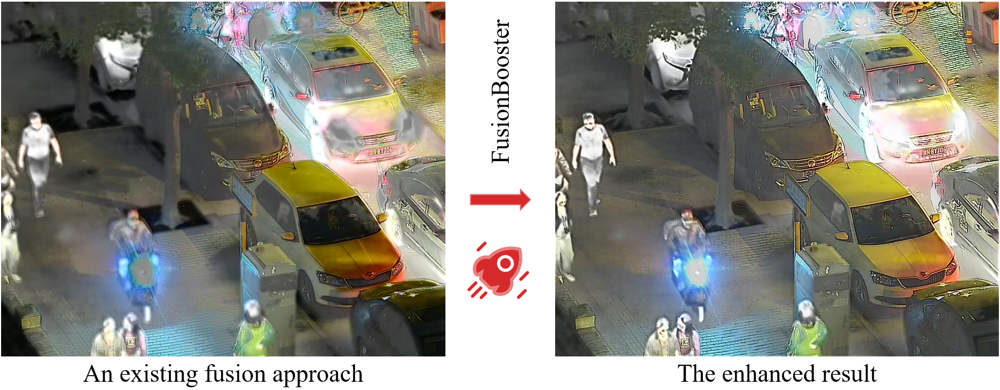

<div align="center">
  
  <p>"Visualisation of the proposed FusionBooster when applied to the infrared and visilble image fusion approach DDcGAN."</p>
</div>

# FusionBooster
This is the offical implementation for the paper titled "FusionBooster: A Unified Image Fusion Boosting Paradigm".

[Paper](https://arxiv.org/abs/2305.05970)


## Environment
```
python 3.7.3
torch 1.9.0
scipy 1.2.0
```
## Test (End to end, you provide two source images, we directly output the enhanced fused image)
Backbone: [MUFusion](https://github.com/AWCXV/MUFusion)
For the IVIF task:
```
python xxx
```

## Test (Booster Only, you provide the initial fused image, we enhance it)
To use our pre-trained FusionBooster to boost an arbitary IVIF method (e.g., DDcGAN):

```
python test_booster_only.py
```

You can modify the path in the "test_booster_only.py" file, to enhance your own fusion results. 

## Announcement
- 2024-10-14 The code for boosting an arbitary method is available ("test_booster_only.py").
- 2024-10-1 Because some of the fusion methods are realised using the tensorflow framework. Our FusionBooster demo will be implemented based on the [MUFusion](https://github.com/AWCXV/MUFusion). You can always use our "detached booster" to enhance your own fusion results. 
- 2024-9-30 This work has been accepted by IJCV.

## Highlight
- We devise an image fusion booster by analysing the quality of the initial fusion results by means of a dedicated Information Probe.
- The proposed FusionBooster is a general enhancer, which can be applied to various image fusion methods, e.g., traditional or learning-based algorithms, irrespective of the type of fusion task.
- In a new divide-and-conquer image fusion paradigm, the results of the analysis performed by the Information Probe guide the refinement of the fused image.
- The proposed FusionBooster significantly enhances the performance of the SOTA fusion methods and downstream detection tasks, with only a slight increase in the computational overhead.

## Citation
If this work is helpful to you, please cite it as:
```
@article{cheng2024fusionbooster,
  title={FusionBooster: A Unified Image Fusion Boosting Paradigm},
  author={Cheng, Chunyang and Xu, Tianyang and Wu, Xiao-Jun and Li, Hui and Li, Xi and Kittler, Josef},
  journal={International Journal of Computer Vision},
  year={2024}
}
```

