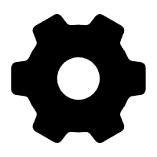

## FusionBooster
This is the offical implementation for the paper titled "FusionBooster: A Unified Image Fusion Boosting Paradigm".

[Paper](https://arxiv.org/abs/2305.05970)


##  Environment
```
python 3.7.3
torch 1.9.0
scipy 1.2.0
```
##  Test 

###  End to end, you provide two source images, we directly output the enhanced fused image

Backbone: MUFusion (If you want to report this result, please mark our mehtod as FBooster-MU)

 IVIF task:
```
python test_e2e_IVIF_rgb.py
```

 MEIF task (to do):

```
python xxx.py
```

 MFIF task:

```
python test_e2e_MFIF_rgb.py
```

###  Booster Only, you provide the initial fused image, we enhance it

To use our pre-trained FusionBooster to boost an arbitary method:

 IVIF task (Backbone: DDcGAN)

```
python test_booster_only_IVIF_rgb.py
```

 MEIF task (to do)

```
python xxx.py
```

 MFIF task (to do)

```
python xxx.py
```

You can modify the path in the "test_booster_only_xxxx.py" file, to enhance your own fusion results. 

##  Train

 IVIF task (Backbone: DDcGAN)

 Dataset:

[Training Set (DDcGAN Results on LLVIP)](https://pan.baidu.com/s/1X58UeWpLSBiFMlRi6pFOLw?pwd=hokf) Password: hokf

[Training Set (Original LLVIP)](https://pan.baidu.com/s/1_I707esOlERfyMiUOzuZQg?pwd=jq15) Password: jq15

(todo):
```
python xxx.py
```

##  Announcement
- 2025-1-18 The code for end-to-end boosting source images (MFIF) is now available. ("test_e2e_MFIF_rgb.py").
- 2024-10-14 The code for end-to-end boosting source images (IVIF) is now available. ("test_e2e_IVIF_rgb.py").
- 2024-10-14 The code for boosting an arbitary method is available ("test_booster_only.py").
- 2024-10-1 Because some of the fusion methods are realised using the tensorflow framework. Our FusionBooster demo will be implemented based on the [MUFusion](https://github.com/AWCXV/MUFusion). You can always use our "detached booster" to enhance your own fusion results. 
- 2024-9-30 This work has been accepted by IJCV.

##  Highlight
- We devise an image fusion booster by analysing the quality of the initial fusion results by means of a dedicated Information Probe.
- The proposed FusionBooster is a general enhancer, which can be applied to various image fusion methods, e.g., traditional or learning-based algorithms, irrespective of the type of fusion task.
- In a new divide-and-conquer image fusion paradigm, the results of the analysis performed by the Information Probe guide the refinement of the fused image.
- The proposed FusionBooster significantly enhances the performance of the SOTA fusion methods and downstream detection tasks, with only a slight increase in the computational overhead.

###  Citation
If this work is helpful to you, please cite it as:
```
@article{cheng2025fusionbooster,
  title={FusionBooster: A Unified Image Fusion Boosting Paradigm},
  author={Cheng, Chunyang and Xu, Tianyang and Wu, Xiao-Jun and Li, Hui and Li, Xi and Kittler, Josef},
  journal={International Journal of Computer Vision},
  year={2025}
}
```

